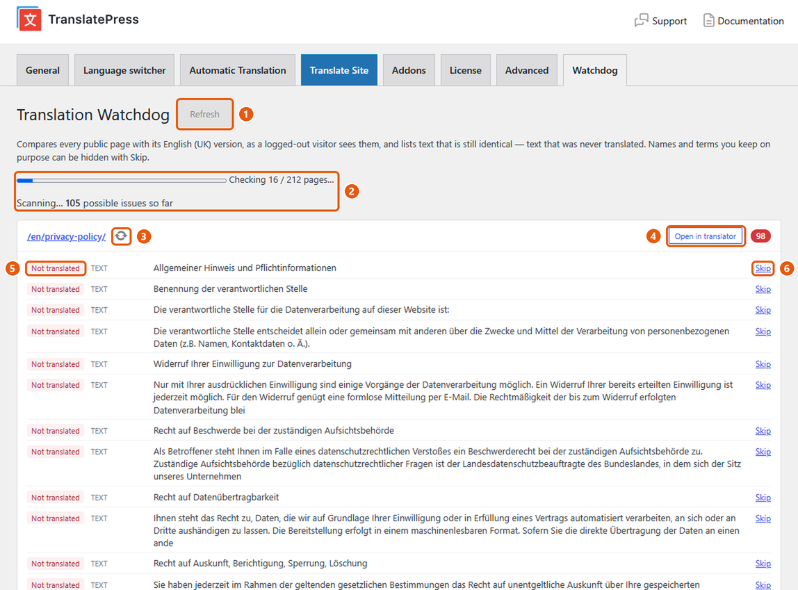
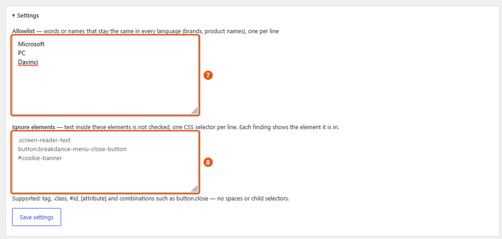
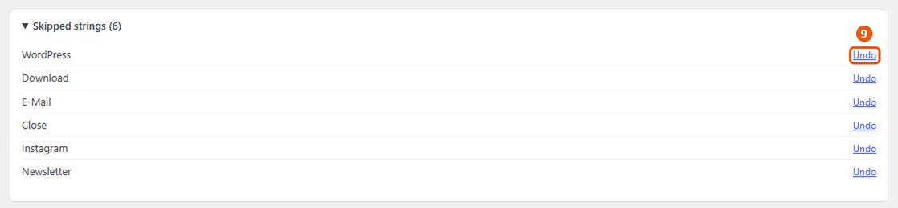

<p align="center"></p>

<h1 align="center">Translation Watchdog for TranslatePress</h1>

Finds text that was never translated on a [TranslatePress](https://wordpress.org/plugins/translatepress-multilingual/) site — for **any language combination**.

It adds a **Watchdog** tab to the TranslatePress settings. On demand, it fetches every public page twice — the original and each translation, as a logged-out visitor sees them — and lists every piece of text that is still identical. TranslatePress' own string tables then tell it *why*:

| Badge | Meaning |
|---|---|
| **Not translated** | TranslatePress knows the text but has no translation. |
| **Translated, not shown** | A translation exists, but the page still shows the original — usually a spelling difference (curly quotes, dashes, HTML entities) between the stored string and the page. |
| **Not in TranslatePress** | The text isn't in TranslatePress' string list — it may come from JavaScript, an image or a plugin TranslatePress doesn't see. |

Text that was deliberately translated to the same words (brand names, "FAQ") is recognised and hidden automatically.

> **Status:** 0.x — in testing. Expect changes.

## How it looks



1. **Refresh** — scans the whole site again. Runs automatically when you open the tab.
2. **Progress** — results appear while the scan runs, with a running count.
3. **Re-check** — checks just this page again after you fixed it.
4. **Open in translator** — opens the page straight in the TranslatePress editor.
5. **Status** — why the text is untranslated (see the table above).
6. **Skip** — hides a false positive, such as a name that stays the same in every language.



7. **Allowlist** — words and names that stay the same in every language (brands, product names). They are ignored inside any text.
8. **Ignore elements** — CSS selectors for whole components that should not be checked, such as a cookie banner. Every finding shows the element it sits in, ready to copy.



9. **Undo** — brings a skipped string back; it shows again on the next scan.

## Why does this exist?

If you translate your site by hand to keep its quality and tone consistent, it's easy to miss a string — a button label, an image's alt text, a line somewhere. And every time you change the design, new strings appear that you might forget to translate.

TranslatePress shows you a page at a time, so there is no quick way to see what's still missing across the whole site. This plugin does exactly that: one scan, and you get a list of every untranslated piece of text, page by page, with a link straight into the TranslatePress editor. So you know your visitors don't see a mix of languages.

## Features

- Checks visible text, image `alt`, `title`, `placeholder`, `aria-label`, the page title and the meta description.
- Runs only when you open the tab or click **Refresh** — nothing in the background.
- Results appear while the scan runs; requests are made in parallel.
- Every finding links to the translated page and straight into the TranslatePress editor.
- **Re-check** (↻) a single page after fixing it, without a full scan — work through the list page by page.
- Header/footer/popup strings are grouped once under **Sitewide**.
- **Skip** hides false positives, **Undo** brings them back; an allowlist ignores brand and product names.
- **Ignore elements**: CSS selectors for whole components that should not be checked (hidden screen-reader text, a cookie banner…). Every finding shows the element it is in.
- **Retry** rescans only the pages that could not be fetched.
- Several translation languages: choose which ones to check.

## Requirements

WordPress 6.5+, PHP 8.0+, TranslatePress (free or paid).

## Installation

Download the zip from the [latest release](../../releases/latest), then *Plugins → Add New → Upload Plugin*. Open *Settings → TranslatePress → Watchdog*.

Updates appear in the WordPress admin like any other plugin (from GitHub releases).

## Filters

| Filter | Purpose |
|---|---|
| `trwatch_urls` | Array of source-language URLs to check. |
| `trwatch_sslverify` | Whether to verify SSL certificates when fetching your own pages (default: off on local hosts such as `*.test`, on everywhere else). |

## Development

```bash
composer install
composer lint     # PHP syntax
composer phpcs    # WordPress security/i18n sniffs
```

Releases: bump the version in the plugin header and `TRWATCH_VERSION`, add a `CHANGELOG.md` entry, then push a tag `vX.Y.Z`. The release workflow builds the zip (with the `.pot` file) and attaches it to a GitHub release.

## License

GPL-2.0-or-later.
